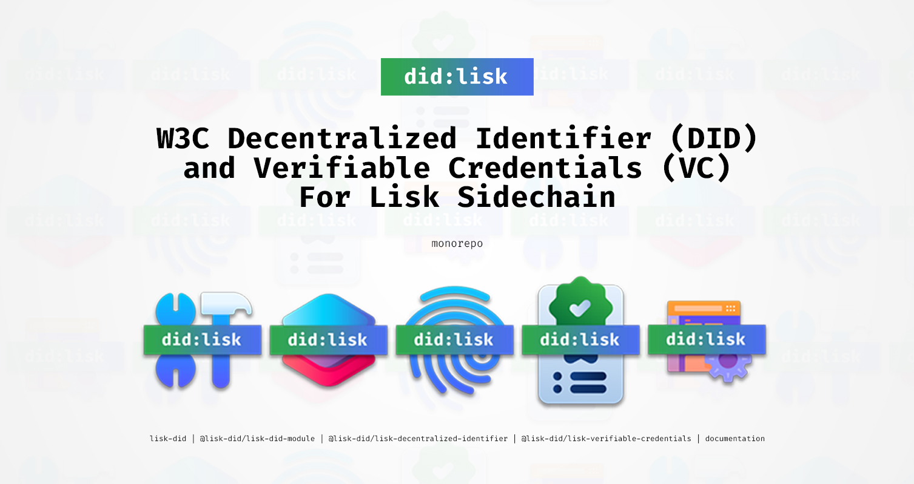

# Lisk DID Monorepo


[](https://github.com/aldhosutra/lisk-did/actions)
[](https://app.codecov.io/gh/aldhosutra/lisk-did)
[](https://github.com/aldhosutra/lisk-did/blob/main/lerna.json)
[](http://www.apache.org/licenses/LICENSE-2.0)

Welcome to the Lisk DID Monorepo! This repository contains a set of powerful tools and packages that empower sidechain developers to build robust and innovative [W3C Decentralized Identifier (DID)](https://www.w3.org/TR/did-core/) and [Verifiable Credentials (VC)](https://www.w3.org/TR/vc-data-model/) solutions within the Lisk Ecosystem.

## About Lisk

Lisk is an open-source blockchain application platform written in Javascript, designed to bridge the gap between accessibility and web3 adoption. Learn more about Lisk from their [official website](https://lisk.com), as well as it's public [GitHub Repository](https://github.com/LiskHQ).

## About `did:lisk` Method

`did:lisk` is a DID method specifically designed for Lisk sidechain, which outlines syntax, data model, and operations that adheres to W3C Decentralized Identifiers (DIDs) Specification.

A `did:lisk` DID consist of a method, chainspace, namespace, and unique-id that suitable for specific, tailored, self-sovereign identity use case. An example of a `did:lisk` identifier, is as follows:

```abnf
did:lisk:enevti:address:lsk9gxy8ua2n5sj7eqvtp554hvce8m39sy39sjwzu
```

Please refer to the [did:lisk method spec](https://github.com/aldhosutra/lisk-did/blob/main/packages/lisk-did-module/docs/did-method-spec.md) draft for further explanation. As its still in under active development, community contribution will be much appreciated.

## Packages

This monorepo consist of 5 packages, as follows:

| Packages                                                                                                     | Description                                                                                                                                                                      |
| ------------------------------------------------------------------------------------------------------------ | -------------------------------------------------------------------------------------------------------------------------------------------------------------------------------- |
| [lisk-did](https://npmjs.com/package/lisk-did)                                                               | Lisk DID/VC Development Kit, which bundles @lisk-did/lisk-did-module, @lisk-did/lisk-decentralized-identifier, and @lisk-did/lisk-verifiable-credentials into one single package |
| [@lisk-did/lisk-did-module](https://npmjs.com/package/@lisk-did/lisk-did-module)                             | Lisk module which implements on-chain logic for Lisk decentralized identifiers (DIDs)                                                                                            |
| [@lisk-did/lisk-decentralized-identifier](https://npmjs.com/package/@lisk-did/lisk-decentralized-identifier) | A library to work with W3C Decentralized Identifier (DID) for Lisk sidechains with the Lisk DID module                                                                           |
| [@lisk-did/lisk-verifiable-credentials](https://npmjs.com/package/@lisk-did/lisk-verifiable-credentials)     | A library for working with W3C verifiable credentials (VC) and verifiable presentations (VP) using Lisk DID                                                                      |
| [lisk-did-docs](https://aldhosutra.github.io/lisk-did)                                                       | Documentation website for Lisk DID packages                                                                                                                                      |

## License

Licensed under the Apache License, Version 2.0 (the "License");
you may not use this file except in compliance with the License.
You may obtain a copy of the License at

    http://www.apache.org/licenses/LICENSE-2.0

Unless required by applicable law or agreed to in writing, software
distributed under the License is distributed on an "AS IS" BASIS,
WITHOUT WARRANTIES OR CONDITIONS OF ANY KIND, either express or implied.
See the License for the specific language governing permissions and
limitations under the License.
