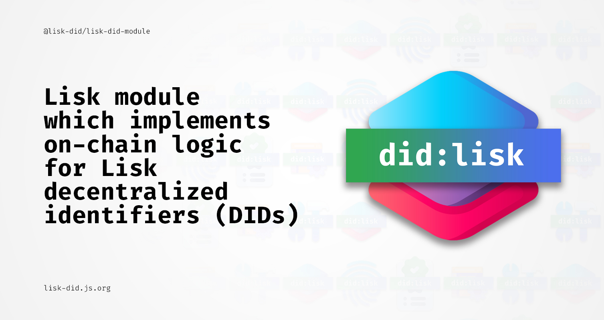

# @lisk-did/lisk-did-module

[](https://npmjs.com/package/@lisk-did/lisk-did-module)
[](https://github.com/aldhosutra/lisk-did/actions)
[](https://app.codecov.io/gh/aldhosutra/lisk-did)
[](http://www.apache.org/licenses/LICENSE-2.0)

Lisk module which implements on-chain logic for Lisk decentralized identifiers (DIDs)

## About Lisk

Lisk is an open-source blockchain application platform written in Javascript, designed to bridge the gap between accessibility and web3 adoption. Learn more about Lisk from their [official website](https://lisk.com), as well as it's public [GitHub Repository](https://github.com/LiskHQ).

## About `did:lisk` Method

`did:lisk` is a DID method specifically designed for Lisk sidechain, which outlines syntax, data model, and operations that adheres to W3C Decentralized Identifiers (DIDs) Specification.

A `did:lisk` DID consist of a method, chainspace, namespace, and unique-id that suitable for specific, tailored, self-sovereign identity use case. An example of a `did:lisk` identifier, is as follows:

```abnf
did:lisk:enevti:address:lsk9gxy8ua2n5sj7eqvtp554hvce8m39sy39sjwzu
```

Please refer to the [did:lisk method spec](https://github.com/aldhosutra/lisk-did/blob/main/packages/lisk-did-module/docs/did-method-spec.md) draft for further explanation. As its still in under active development, community contribution will be much appreciated.

## Module Architecture


## Getting Started

### Sidechain Setup

Since this tool is tailored for Lisk-based sidechains, you need to start by setting up a blockchain client. You can find guidance on configuring your blockchain environment in the official [Lisk Documentation](https://lisk.com/documentation/beta/build-blockchain/create-blockchain-client.html), as well as in [Lisk Discord #dev-chat channel](https://lisk.chat/)

### Installation

```sh
npm install --save @lisk-did/lisk-did-module
```

### Module Configurations

Under your blockchain config folder, please specify required configurations for did module:

```json
{
  "<...other_config>": "",
  "modules": {
    "did": {
      "chainspace": "enevti",
      "autoCreateAddressDID": true
    },
    "<...other_modules>": ""
  }
}
```

Those configuration can be explained as follows:

1. **chainspace**: (REQUIRED) chainspace to be used by your chain's DID. `did:lisk` require a chainspace to be defined, as it's format is as follows: `did:lisk:{chainspace}:{namespace}:{unique-id}`
2. **autoCreateAddressDID**: (default to true) whether you want to enable auto address DID creation. If this option is enabled, an address DID will be automatically created when the address sends any transaction.

### Register Module

Last step is to register did module to your blockchain app. Add this code to `./src/app/modules.ts` as follows:

```typescript
import { DidModule } from '@lisk-did/lisk-did-module';

export const registerModules = (app: Application, method: LiskMethod): void => {
  // your other module registration
  app.registerModule(new DidModule()); // add this
};
```

## Documentation

For further explanations, please refer to [lisk-did documentation](https://lisk-did.js.org) website.

## License

Licensed under the Apache License, Version 2.0 (the "License");
you may not use this file except in compliance with the License.
You may obtain a copy of the License at

    http://www.apache.org/licenses/LICENSE-2.0

Unless required by applicable law or agreed to in writing, software
distributed under the License is distributed on an "AS IS" BASIS,
WITHOUT WARRANTIES OR CONDITIONS OF ANY KIND, either express or implied.
See the License for the specific language governing permissions and
limitations under the License.
