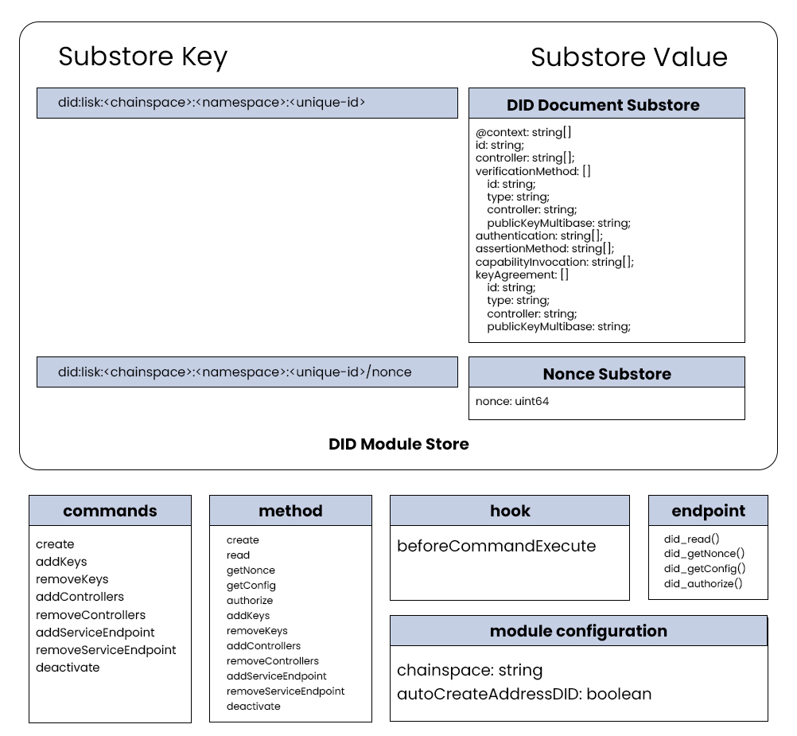

# `did:lisk` Method Specification

```
Title: did:lisk Method Specification
Author: Aldo Suhartono Putra <aldhosutra@gmail.com>
Version: 2023.08.19

Version History:
- 2023.08.19: Initial release.

Last Modified: August 19, 2023
```

This document defines the syntax, data model, and operations for the `did:lisk` Decentralized Identifier (DID) method, specifically for the Lisk Sidechain.

This specification is under active development at [https://github.com/aldhosutra/lisk-did/blob/main/packages/lisk-did-module/did-method-spec.md](https://github.com/aldhosutra/lisk-did/blob/main/packages/lisk-did-module/docs/did-method-spec.md).

## Abstract

Decentralized Identifiers (DIDs) [[1]](#ref1) introduce a novel form of identifiers that facilitate verifiable, self-sovereign digital identity. This Lisk [[2]](#ref2) DID method specification outlines a new DID method, namely `did:lisk`, and details the on-chain store a of Lisk DIDs and their corresponding DID documents on a Lisk Application sidechain, including the brief sidechain module implementation. Furthermore, the specification provides guidelines for performing operations on Lisk DID documents.

It is essential to highlight that this specification adheres to the prerequisites specified in the [DIDs specification](https://www.w3.org/TR/did-core/) presently published by the W3C Credentials Community Group.

## Architecture Overview

Within the Lisk Blockchain ecosystem, [Lisk Applications](https://lisk.com/documentation/beta/understand-blockchain/index.html#what-are-lisk-applications) function as independent blockchains built using the Lisk SDK. [Lisk Sidechains](https://lisk.com/documentation/beta/understand-blockchain/index.html#what-is-the-lisk-blockchain), on the other hand, are Lisk Applications connected to the Lisk Mainchain through the [Lisk Interoperability protocol](https://lisk.com/documentation/beta/understand-blockchain/interoperability/index.html). These application chains consist of diverse modules responsible for executing distinct on-chain logic.

To enable `did:lisk` functionality on a Lisk Sidechain, it is imperative to implement a dedicated [Lisk DID Module](https://github.com/aldhosutra/lisk-did/blob/main/packages/lisk-did-module) within the Sidechain. This module incorporates a collection of transactions, methods, hooks, and endpoints, designed to manage a specific set of DID document properties for a given `did:lisk` on a particular sidechain.

Detailed information regarding the module's implementation is elaborated in the [DID Operations](#DID-Operations) section provided below.

## `did:lisk` Syntax

`did:lisk` DIDs can take two forms:

```abnf
did:lisk:<chainspace>:<namespace>:<unique-id>
did:lisk:<chainspace>:<unique-id>
```

The second form is a simplified version where the `<namespace>` is automatically resolved to `"address"`. Consequently, the `<unique-id>` in the second form must adhere to the valid address format specified in [LIP 0018](https://github.com/LiskHQ/lips/blob/main/proposals/lip-0018.md) [[3]](#ref3).

In that sense, all components of the primary Lisk DID syntax are essentially required. As a result, the first form will serve as the key to map the DID document on the on-chain stores.

### did:lisk ABNF

```abnf
did-lisk           = "did:lisk:" method-specific-id
method-specific-id = chainspace [":" namespace] ":" unique-identifier
chainspace         = 1*chainchar
namespace          = *id-char
unique-identifier  = *( *id-char ":" ) 1*id-char
id-char            = ALPHA / DIGIT / "." / "-" / "_" / pct-encoded
chainchar          = %x61-7A / DIGIT / "!" / "$" / "&" / "_"
pct-encoded        = "%" HEXDIG HEXDIG
```

### Method Name

A DID that adopts the this Lisk DID method MUST commence with the prefix `"did:lisk"`. The prefix string MUST be in lowercase.

### Method Specific Identifier

The `did:lisk` method-specific identifier (`method-specific-id`) comprises three components: a required `chainspace`, an optional `namespace`, and a required `unique-id` component.

1. The `chainspace` is defined as a string that identifies a specific Lisk Application blockchain (e.g. `"enevti"`, `"kruuu"`, `"colecti"`) where the DID reference is stored.
2. The `namespace` is an alphanumeric string that identifies a distinct namespace managed by the application chain's name server module. These namespaces, (e.g., `"address"`, `"pos"`, `"nft"`, `"token"`), indicate the `unique-id` context whithin that specific chain.
3. The `unique-id` is mixed character string that uniquely identifies an identity managed by the application chain under the namespace defined by the `namespace` component.

If the `namespace` is not provided, the DID module will automatically resolve the `namespace` to `"address"`. In such cases, the `unique-id` must adhere to a valid address format.

### `did:lisk` DID-URL syntax

`did:lisk` DIDs may also be used in DID-URLs, based on [RFC3986](https://www.w3.org/TR/did-core/#bib-rfc3986) [[7]](#ref7)

```abnf
lisk-did-url  = lisk-did [path-abempty] [ "#" fragment ]
path-abempty  = *( "/" segment )
segment       = *pchar
segment-nz    = 1*pchar
segment-nz-nc = 1*( unreserved / pct-encoded / sub-delims / "@" )
pchar         = unreserved / pct-encoded / sub-delims / ":" / "@"
fragment      = *( pchar / "/" / "?" )
```

NOTE: `did:lisk` does not support `query` parts. The path and fragment parts are defined below.

### Examples of `did:lisk` identifiers

A DID written to the Enevti Blockchain network "nft" `namespace`:

```abnf
did:lisk:enevti:nft:004e4556b3d8553e8962
```

A DID written to the Kruuu Blockchain network "address" `namespace`:

```abnf
did:lisk:kruuu:address:lsk9gxy8ua2n5sj7eqvtp554hvce8m39sy39sjwzu
```

Above DID will point to the same DID Document as following DID:

```abnf
did:lisk:kruuu:lsk9gxy8ua2n5sj7eqvtp554hvce8m39sy39sjwzu
```

A DID written to the Kruuu Blockchain network "address" namespace with a encoded public key fragment:

```abnf
did:lisk:kruuu:address:lsk9gxy8ua2n5sj7eqvtp554hvce8m39sy39sjwzu#z6LSqc7Q3MgFLWD39rLg3ZmrWcyN2SyEyVrTFVhNjERyDFkE
```

## DID Documents

The DID document for the `did:lisk` method is obligated to conform strictly to the DID Core specifications [[4]](#ref4). This entails the inclusion of the essential `DID document` properties, along with `verificationMethod`, `keyAgreement`, and `service` properties.

Given that the Lisk blockchain operates using the Ed25519 signature scheme, the `did:lisk` method exclusively supports public key and signing algorithms that are based on EdDSA signatures with the Ed25519 curve.

Lisk DID extends support to multiple controllers and/or keys with diverse Verification Relationship capabilities. The current implementation accommodates four types of verification relationships, namely `authentication`, `assertionMethod`, `capabilityInvocation`, and `keyAgreement`.

#### Lisk DID JSON Schema

```json
didDocumentSchema = {
  "type": "object",
  "required": [
    "context",
    "id",
    "controller",
    "verificationMethod",
    "authentication",
    "assertionMethod",
    "capabilityInvocation",
    "keyAgreement",
    "service"
  ],
  "properties": {
    "context": {
      "type": "array",
      "fieldNumber": 1,
      "items": {
        "dataType": "string"
      }
    },
    "id": {
      "dataType": "string",
      "fieldNumber": 2
    },
    "controller": {
      "type": "array",
      "fieldNumber": 3,
      "items": {
        "dataType": "string"
      }
    },
    "verificationMethod": {
      "type": "array",
      "fieldNumber": 4,
      "items": {
        "type": "object",
        "required": [
          "id",
          "type",
          "controller",
          "publicKeyMultibase"
        ],
        "properties": {
          "id": {
            "dataType": "string",
            "fieldNumber": 1
          },
          "type": {
            "dataType": "string",
            "fieldNumber": 2
          },
          "controller": {
            "dataType": "string",
            "fieldNumber": 3
          },
          "publicKeyMultibase": {
            "dataType": "string",
            "fieldNumber": 4
          }
        }
      }
    },
    "authentication": {
      "type": "array",
      "fieldNumber": 5,
      "items": {
        "dataType": "string"
      }
    },
    "assertionMethod": {
      "type": "array",
      "fieldNumber": 6,
      "items": {
        "dataType": "string"
      }
    },
    "capabilityInvocation": {
      "type": "array",
      "fieldNumber": 7,
      "items": {
        "dataType": "string"
      }
    },
    "keyAgreement": {
      "type": "array",
      "fieldNumber": 8,
      "items": {
        "type": "object",
        "required": [
          "id",
          "type",
          "controller",
          "publicKeyMultibase"
        ],
        "properties": {
          "id": {
            "dataType": "string",
            "fieldNumber": 1
          },
          "type": {
            "dataType": "string",
            "fieldNumber": 2
          },
          "controller": {
            "dataType": "string",
            "fieldNumber": 3
          },
          "publicKeyMultibase": {
            "dataType": "string",
            "fieldNumber": 4
          }
        }
      }
    },
    "service": {
      "type": "array",
      "fieldNumber": 9,
      "items": {
        "type": "object",
        "required": [
          "id",
          "type",
          "serviceEndpoint"
        ],
        "properties": {
          "id": {
            "dataType": "string",
            "fieldNumber": 1
          },
          "type": {
            "dataType": "string",
            "fieldNumber": 2
          },
          "serviceEndpoint": {
            "dataType": "string",
            "fieldNumber": 3
          }
        }
      }
    }
  }
}
```

#### Lisk DID Document Example

```json
{
  "@context": [
    "https://www.w3.org/ns/did/v1",
    "https://w3id.org/security/suites/ed25519-2020/v1",
    "https://w3id.org/security/suites/x25519-2020/v1"
  ],
  "id": "did:lisk:kruuu:lskc9ccbzjt9tvh2h82a3jor3qwmwdhf2hwcuhge2",
  "controller": ["did:lisk:kruuu:lskc9ccbzjt9tvh2h82a3jor3qwmwdhf2hwcuhge2"],
  "verificationMethod": [
    {
      "id": "did:lisk:kruuu:lskc9ccbzjt9tvh2h82a3jor3qwmwdhf2hwcuhge2#z6Mkrgb4BmwobDHr5SV1XwtfFFvJVqVRLnwYtbYFdVRPSACL",
      "type": "Ed25519VerificationKey2020",
      "controller": "did:lisk:kruuu:lskc9ccbzjt9tvh2h82a3jor3qwmwdhf2hwcuhge2",
      "publicKeyMultibase": "z6Mkrgb4BmwobDHr5SV1XwtfFFvJVqVRLnwYtbYFdVRPSACL"
    }
  ],
  "authentication": [
    "did:lisk:kruuu:lskc9ccbzjt9tvh2h82a3jor3qwmwdhf2hwcuhge2#z6Mkrgb4BmwobDHr5SV1XwtfFFvJVqVRLnwYtbYFdVRPSACL"
  ],
  "assertionMethod": [
    "did:lisk:kruuu:lskc9ccbzjt9tvh2h82a3jor3qwmwdhf2hwcuhge2#z6Mkrgb4BmwobDHr5SV1XwtfFFvJVqVRLnwYtbYFdVRPSACL"
  ],
  "capabilityInvocation": [
    "did:lisk:kruuu:lskc9ccbzjt9tvh2h82a3jor3qwmwdhf2hwcuhge2#z6Mkrgb4BmwobDHr5SV1XwtfFFvJVqVRLnwYtbYFdVRPSACL"
  ],
  "keyAgreement": [
    {
      "id": "did:lisk:kruuu:lskc9ccbzjt9tvh2h82a3jor3qwmwdhf2hwcuhge2#z6LSdv2JvMoD2dEZDvSxmCJwUMr64ANGA2PWrcBQiiwj6ctE",
      "type": "X25519KeyAgreementKey2020",
      "controller": "did:lisk:kruuu:lskc9ccbzjt9tvh2h82a3jor3qwmwdhf2hwcuhge2",
      "publicKeyMultibase": "z6LSdv2JvMoD2dEZDvSxmCJwUMr64ANGA2PWrcBQiiwj6ctE"
    }
  ]
}
```

### W3C Compliant DID Document Properties

1. **`@context`**: The serialized value of @context MUST be a JSON Array where the first item is the JSON String `https://www.w3.org/ns/did/v1` and the subsequent items are serialized according to the JSON representation production rules.
2. **`id`**: A _did:lisk_ DID, adhering to the format defined in this document.
3. **`controller`**: A list of fully qualified DID strings. This list contains one or more DIDs, and their verification relationships MUST be considered valid for this DID.
4. **`verificationMethod`**: A list of Verification Methods that define how to authenticate or authorize interactions with the DID subject or its delegates
5. **`authentication`**: A list of strings with key aliases or IDs. Keys with this relationship are restricted to be used solely for authentication purposes, indicating that they can convince the other party that they belong to the DID.
6. **`assertionMethod`**: A list of strings with key aliases or IDs. Keys with this relationship are employed for signing credentials during issuance.
7. **`capabilityInvocation`**: A list of strings with key aliases or IDs. These keys possess the ability to modify the DID Document, enabling the addition or removal of new keys, service endpoints, controllers, etc. If a DID has one or more such keys, it is said to "control" itself, signifying that it can modify its own DID Document.
8. **`keyAgreement`**: A list of objects with key aliases or IDs. These keys are used during secure communication to encrypt data for the DID.
9. **`service`**: A set of Service Endpoint maps. Services expressed in the DID document define the means of communication with the DID subject or associated entities.

### Verification Method and Key Agreement Properties

1. **`id`**: An URI string following the `did:lisk` syntax, appended by `#<key-fingerprint>`. For example: `did:lisk:kruuu:address:lsk9gxy8ua2n5sj7eqvtp554hvce8m39sy39sjwzu#z6Mkrgb4BmwobDHr5SV1XwtfFFvJVqVRLnwYtbYFdVRPSACL`.
2. **`controller`**: A string with a fully qualified DID. The specified DID must exist.
3. **`type`**: A string indicating the type of verification method
4. **`publicKeyMultibase`**: A base58-encoded string adhering to the MULTIBASE [[5]](#ref5) encoded public key.

Note: The Ed25519 verification method does not include `publicKeyJwk`. For further details, refer to the EdDSA Cryptosuite v2020 specifications by the W3C Community Group [[6]](#ref6).

### Service Property

1. **`id`**: A string representing the ID of the service. The value of the `id` property for a Service MUST be a URI conforming to RFC3986 [[7]](#ref7). A conforming producer MUST NOT produce multiple service entries with the same ID. Likewise, a conforming consumer MUST produce an error if it detects multiple service entries with the same ID. The ID can be in one of the following formats: `<did-document-id>#<service-alias>` or `#<service-alias>`.
2. **`type`**: A string indicating the service type. The service type and its associated properties SHOULD be registered in the DID Specification Registries [[8]](#ref8)
3. **`serviceEndpoint`**: A string that adheres to the rules of RFC3986 [[7]](#ref7) for URIs.

## DID Operations



The operation of `did:lisk` DID and their associated DID documents is facilitated through a dedicated Lisk SDK module, encompassing essential components according to [LIP 0069](https://github.com/LiskHQ/lips/blob/main/proposals/lip-0069.md) [[9]](#ref9) specification, such as configuration settings, transaction handling, method integration, hooks, and endpoints. A comprehensive reference implementation of the [Lisk DID Module](https://github.com/aldhosutra/lisk-did/blob/main/packages/lisk-did-module) is available for further examination and utilization.

### Transaction Fee & Module Configurations

Within the context of the Lisk Application blockchain, the execution of a Lisk DID operation mandates the payment of a blockchain transaction fee. The specific fee amount is contingent upon the byte length of the transaction, as well as the minimum fee configuration settings [[10]](#ref10).

This transaction fee is denominated according to the specific configuration of the network. Consequently, operations involving the creation, updating, and deletion of DIDs necessitate the execution of corresponding transactions that incur these transaction fees.

Furthermore, a Lisk Application sidechain that implements [Lisk DID Module](https://github.com/aldhosutra/lisk-did/blob/main/packages/lisk-did-module) needs to configure their `chainspace` identifier in the Lisk DID module config.

### `signer` and `sender` Keys Decoupling

Please be advised that the accounts utilized to send transactions are separate from the keys associated with the DID. As a result, the DID could have been created using one account, updated with another account, and removed with yet another account.

To account for this, several operation includes a `signature` parameter, which indicates the key associated with the DID as the `signer`, rather than the `sender`. The payload being signed, in this case, consists of the encoded bytes of the parameter appended with the DID's nonce, ensuring a secure signature that is protected from replay attacks. To obtain the DID's nonce from another sidechain module, following `getNonce` method can be utilized:

```typescript
didMethod.getNonce(
    context: MethodContext,
    did: string,
) => nonce
```

Similarly, to get DID's nonce from external environment, a `did_getNonce` endpoint can be invoked:

```typescript
did_getNonce(did: string) => nonce
```

However, if the public key of the actual transaction `sender` aligns with the `signer` and/or `target` in the DID operation transaction, and possesses valid verification methods and relationships in the DID document, the `signature` parameter becomes unnecessary. This is because the sender is already authorized within the context of the transaction. Furthermore, there are four distinct scenario for authorized operations:

1. `signature` is provided, `signer` is the target's DID subject that have `capabilityInvocation` relationship with target's DID.
2. `signature` is provided, `signer` is the target's DID controller that have `authentication` relationship with signer's DID.
3. `sender` sends valid transaction with privateKey that have `capabilityInvocation` relationship with target's DID. In this case both `signer` and `signature` field becomes unnecessary.
4. `sender` sends valid transaction with `signer` field which present in target's DID controller, that have `authentication` relationship with signer's DID. In this case `signature` field becomes unnecessary.
5. target's DID controller is `sender` DID with `address` namespace that have `authentication` relationship available. In this case both `signer` and `signature` field becomes unnecessary.

Nonetheless, there exists a distinct scenario for authorized `deactivate` operations, where the authorized `sender` or `signer` must be the final controller of the designated target DID. Additionally, `sender` or `signer` must control the last key, if not, the target DID must have all its available keys removed.

### `authorize` Method and Endpoint

Lisk sidechain modules and external tools can examine the specified `publicKey` verification relationship through the provided `authorize` method and/or endpoint. This flexibility empowers sidechain developers to craft custom solutions leveraging DID authorization for their specific use cases.

The result of this method and/or endpoint, is an array of `AuthorizationResult` that cointains specific properties. Result with at least one item indicate successful authorization. The properties are as follows:

1. `type`: A string that shows relationship between publicKey's controller and the DID document. The value can be `"subject"`, or `"controller"`.
2. `did`: A string representing DID that have relationship with provided authorized keys.
3. `relationship`: A list of string that shows verification relationship between provided keys, and the DID document with above `type`. The value can be `"authentication"`, `"assertionMethod"`, `"capabilityInvocation"`, or `"keyAgreement"`;

Following is provided `authorize` method, tailored for on-chain usage:

// TODO: add authorization factor to method and endpoint

```typescript
didMethod.authorize(
    context: MethodContext,
    did: string,
    publicKey: bytes,
) => AuthorizationResult[]
```

Furthermore, following is provided `did_authorize` endpoint, that serves off-chain purposes:

```typescript
did_authorize(did: string, publicKey: bytes) => AuthorizationResult[]
```

### Create DID (Register)

In order to create a Lisk DID, users must have the capability to initiate a transaction, necessitating the possession of a valid ed25519 private key. There are three distinct scenarios for creating a DID.

#### 1. Using `create` Transaction

The first scenario involves creating a DID with any `<namespace>`. To achieve this, users are required to submit a transaction [[11]](#ref11) utilizing the `did` as module name, and specify `create` as the command name, incorporating the asset with the following schema:

```json
createDIDSchema = {
    "type": "object",
    "required": [
        "did",
        "keys",
        "controllers",
    ],
    "properties": {
        "did": {
            "dataType": "string",
            "fieldNumber": 1
        },
        "controllers": {
            "fieldNumber": 2,
            "type": "array",
            "items": {
                "dataType": "string"
            }
        },
        "keys": {
            "type": "array",
            "fieldNumber": 3,
            "items": {
                "type": "object",
                "required": ["publicKey", "relationship"],
                "properties": {
                    "publicKey": {
                        "dataType": "bytes",
                        "fieldNumber": 1
                    },
                    "relationship": {
                        "type": "array",
                        "fieldNumber": 2,
                        "items": {
                            "dataType": "string",
                        },
                    },
                },
            },
        },
    }
}
```

#### 2. Using `create` Method

The Lisk SDK provides an inter-module communication `method` that facilitates interaction among different modules within the sidechain ecosystem. Specifically, external modules on the sidechain have the capability to invoke the `create` method from the [Lisk DID Module](https://github.com/aldhosutra/lisk-did/blob/main/packages/lisk-did-module), utilizing the specified parameters as described above, to initiate the creation of a new Decentralized Identifier (DID).

```typescript
didMethod.create(
    context: MethodContext,
    senderPublicKey: bytes,
    did: string,
    controllers: string[],
    keys: { publicKey: bytes; relationship: string[] }[],
) => void
```

#### 3. Automatic Address DID Creation

The final scenario involves the creation of a Lisk DID with the designated `"address"` as `<namespace>`. It is important to note that the `"address"` DID cannot be created directly through `create` commands or methods above. Instead, the `"address"` DID will be automatically generated for any address that does not have an associated DID Document **when that address send any transaction on the respective sidechain**.

To achieve this functionality, the `beforeCommandExecute` hook is employed, with additional `autoCreateAddressDID` module configuration. Within the `did` module, a validation process is performed by inspecting the chain state for the key `"did:lisk:<chainspace>:address:<senderAddress>"`. In cases where the key does not exist, a new DID document is created, thereby ensuring seamless DID generation for the respective address during transaction execution. This behaviour can be changed by setting available module configuration mentioned above.

DIDs created through this scenario will inherently possess all the verification relationships supported by Lisk DID. This is due to the fact that by sending a transaction, the sender has already demonstrated their control over the associated address, thus establishing the necessary verification relationships.

### Read DID (Resolve and Verify)

The [Lisk DID module](https://github.com/aldhosutra/lisk-did/blob/main/packages/lisk-did-module) employs an endpoint and a method to facilitate DID resolution and verification for both users and other sidechain modules.

#### 1. `read` Method

Other sidechain modules can utilize the `read` method to resolve and verify a DID, by providing the DID syntax outlined in this document as an argument to the method:

```typescript
didMethod.read(
    context: MethodContext,
    did: string,
) => DIDDocument
```

#### 2. `read` Endpoint

Users can invoke the `did_read()` endpoint to resolve and verify a DID by passing the DID syntax specified in this document as a parameter to the endpoint:

```typescript
did_read(did: string) => DIDDocument
```

It is important to note that RPC configuration is necessary on the sidechain node to enable successful invocation of the endpoint.

### Update DID (Modification)

Lisk DID Modules provides several commands and methods to facilitate Update DID operations.

#### 1. `addKeys` Command and Method

This operation offers a mechanism to append a new keypair to the designated target DID, along with the specified verification relationships. Newly added keys will be controlled by target DID subject. Assets command schema can be defined as follows:

```json
addKeysSchema = {
    "type": "object",
    "required": [
        "target",
        "keys",
        "signer",
        "signature",
    ],
    "properties": {
        "target": {
            "dataType": "string",
            "fieldNumber": 1
        },
        "keys": {
            "type": "array",
            "fieldNumber": 2,
            "items": {
                "type": "object",
                "required": ["publicKey", "relationship"],
                "properties": {
                    "publicKey": {
                        "dataType": "bytes",
                        "fieldNumber": 1
                    },
                    "relationship": {
                        "type": "array",
                        "fieldNumber": 2,
                        "items": {
                            "dataType": "string",
                        },
                    },
                },
            },
        },
        "signer": {
            "dataType": "string",
            "fieldNumber": 3
        },
        "signature": {
            "dataType": "bytes",
            "fieldNumber": 4
        },
    }
}
```

Similarly, `addKeys` method can be invoked using above parameters:

```typescript
didMethod.addkeys(
    context: MethodContext,
    senderPublicKey: bytes,
    target: string,
    keys: { publicKey: bytes; relationship: string[] }[],
    signer: string,
    signature: bytes,
) => void
```

#### 2. `removeKeys` Command and Method

This operation offers a mechanism to remove a keypair from the designated target DID, all verification methods associated with the key will also be removed. Assets command schema can be defined as follows:

```json
removeKeysSchema = {
    "type": "object",
    "required": [
        "target",
        "publicKeys",
        "signer",
        "signature",
    ],
    "properties": {
        "target": {
            "dataType": "string",
            "fieldNumber": 1
        },
        "publicKeys": {
            "fieldNumber": 2,
            "type": "array",
            "items": {
                "dataType": "bytes"
            }
        },
        "signer": {
            "dataType": "string",
            "fieldNumber": 3
        },
        "signature": {
            "dataType": "bytes",
            "fieldNumber": 4
        },
    }
}
```

Similarly, `removeKeys` method can be invoked using above parameters:

```typescript
didMethod.removeKeys(
    context: MethodContext,
    senderPublicKey: bytes,
    target: string,
    publicKeys: Buffer[],
    signer: string,
    signature: bytes,
) => void
```

#### 3. `addControllers` Command and Method

This operation offers a mechanism to add a new controller to the designated target DID. Assets command schema can be defined as follows:

```json
addControllersSchema = {
    "type": "object",
    "required": [
        "target",
        "controllers",
        "signer",
        "signature",
    ],
    "properties": {
        "target": {
            "dataType": "string",
            "fieldNumber": 1
        },
        "controllers": {
            "fieldNumber": 2,
            "type": "array",
            "items": {
                "dataType": "string"
            }
        },
        "signer": {
            "dataType": "string",
            "fieldNumber": 3
        },
        "signature": {
            "dataType": "bytes",
            "fieldNumber": 4
        },
    }
}
```

Similarly, `addControllers` method can be invoked using above parameters:

```typescript
didMethod.addControllers(
    context: MethodContext,
    senderPublicKey: bytes,
    target: string,
    controllers: string[],
    signer: string,
    signature: bytes,
) => void
```

#### 4. `removeControllers` Command and Method

This operation offers a mechanism to remove a controller from the designated target DID. All keys and verification methods associated with the controllers will also be removed. Assets command schema can be defined as follows:

```json
removeControllersSchema = {
    "type": "object",
    "required": [
        "target",
        "controllers",
        "signer",
        "signature",
    ],
    "properties": {
        "target": {
            "dataType": "string",
            "fieldNumber": 1
        },
        "controllers": {
            "fieldNumber": 2,
            "type": "array",
            "items": {
                "dataType": "string"
            }
        },
        "signer": {
            "dataType": "string",
            "fieldNumber": 3
        },
        "signature": {
            "dataType": "bytes",
            "fieldNumber": 4
        },
    }
}
```

Similarly, `removeControllers` method can be invoked using above parameters:

```typescript
didMethod.removeControllers(
    context: MethodContext,
    senderPublicKey: bytes,
    target: string,
    controllers: string[],
    signer: string,
    signature: bytes,
) => void
```

Please be aware that if the specified `controllers` set for removal represents the sole and final controllers, this command or method will result in an invalid transaction. This is because removing all controllers equates to deactivating the DID. In such cases, the executor can instead utilize the `deactivate` command or method.

#### 5. `addServiceEndpoint` Command and Method

This operation offers a mechanism to add a new service endpoint entries to the designated target DID. Assets command schema can be defined as follows:

```json
addServiceEndpointSchema = {
    "type": "object",
    "required": [
        "target",
        "endpoint",
        "signer",
        "signature",
    ],
    "properties": {
        "target": {
            "dataType": "string",
            "fieldNumber": 1
        },
        "endpoint": {
            "type": "object",
            "fieldNumber": 2,
            "required": ["id", "type", "serviceEndpoint"],
            "properties": {
                "id": {
                    "dataType": "string",
                    "fieldNumber": 1,
                },
                "type": {
                    "dataType": "string",
                    "fieldNumber": 2,
                },
                "serviceEndpoint": {
                    "dataType": "string",
                    "fieldNumber": 3,
                },
            },
        },
        "signer": {
            "dataType": "string",
            "fieldNumber": 3
        },
        "signature": {
            "dataType": "bytes",
            "fieldNumber": 4
        },
    }
}
```

Similarly, `addServiceEndpoint` method can be invoked using above parameters:

```typescript
didMethod.addServiceEndpoint(
    context: MethodContext,
    senderPublicKey: bytes,
    target: string,
    endpoint: {
        id: string;
        type: string;
        serviceEndpoint: string;
    };
    signer: string,
    signature: bytes,
) => void
```

#### 6. `removeServiceEndpoint` Command and Method

This operation offers a mechanism to remove a service endpoint from the designated target DID. Assets command schema can be defined as follows:

```json
removeServiceEndpointSchema = {
    "type": "object",
    "required": [
        "target",
        "endpointId",
        "signer",
        "signature",
    ],
    "properties": {
        "target": {
            "dataType": "string",
            "fieldNumber": 1
        },
        "endpointId": {
            "dataType": "string",
            "fieldNumber": 2
        },
        "signer": {
            "dataType": "string",
            "fieldNumber": 3
        },
        "signature": {
            "dataType": "bytes",
            "fieldNumber": 4
        },
    }
}
```

Similarly, `removeServiceEndpoint` method can be invoked using above parameters:

```typescript
didMethod.removeServiceEndpoint(
    context: MethodContext,
    senderPublicKey: bytes,
    target: string,
    endpointId: string,
    signer: string,
    signature: bytes,
) => void
```

### Delete DID (Deactivation)

To deactivate a Lisk DID, it is sufficient to remove all controllers, verification methods, and verification relationships from the associated DID document, indicating that the DID is no longer active. In this scenario, no authentication method can be utilized to authenticate the holder's identity.

Furthermore, it is essential to understand that deactivating or deleting a Lisk DID results in the irreversible action of rendering the DID unusable. Once deactivated, the DID cannot be re-registered or reactivated again.

To deactivate a DID, transaction with as module name and `deactivate` as the command name needs to be submitted, incorporating the asset with the following schema:

```json
deactivateDIDSchema = {
    "type": "object",
    "required": [
        "target",
        "signer",
        "signature",
    ],
    "properties": {
        "target": {
            "dataType": "string",
            "fieldNumber": 1
        },
        "signer": {
            "dataType": "string",
            "fieldNumber": 2
        },
        "signature": {
            "dataType": "bytes",
            "fieldNumber": 3
        },
    }
}
```

Similarly, `deactivate` method can be invoked using above parameters:

```typescript
didMethod.deactivate(
    context: MethodContext,
    senderPublicKey: bytes,
    target: string,
    signer: string,
    signature: bytes,
) => void
```

## Security Considerations

The Lisk Decentralized Identifier (DID) method, known as `did:lisk`, is designed specifically for Lisk Application sidechains. By default, these sidechains inherently ensure a secure chain state by utilizing a `proof-of-stake` algorithm. Additionally, the Lisk platform allows for custom consensus algorithm implementations, providing flexibility and adaptability for different level of security attribute.

The Lisk SDK has been subject to a comprehensive external security audit, [successfully validating its security measures](https://lisk.com/blog/posts/external-security-audit-lisk-sdk-5.0.0-and-lisk-core-3.0.0). For all `did:lisk` DIDs, the initial asset creation and subsequent updates are executed using Ed25519 keys, which are widely recognized as a robust and secure cryptographic mechanism.

## Privacy

Considering privacy concerns, a Decentralized Identifier (DID) can be regarded as pseudonymous. However, users should be aware that the implementation of this Lisk DID, being registered on-chain in a decentralized manner, is not entirely revocable. Additionally, it is essential to acknowledge that a DID document, once registered, can solely be modified by authorized controller as a part of privacy considerations. Hence, Lisk DID documents should be limited to verification methods and service endpoints, and should not store any personal information.

## Reference Implementations

The reference implementation is available here: https://github.com/aldhosutra/lisk-did/blob/main/packages/lisk-did-module

## References

<a name="ref1">[1]</a> W3C Decentralized Identifiers (DIDs) v1.0, https://w3c.github.io/did-core/

<a name="ref2">[2]</a> Lisk, https://lisk.com

<a name="ref3">[3]</a> LIP 0018: Use long hash of public key for address and Base32 encoding for UI, https://github.com/LiskHQ/lips/blob/main/proposals/lip-0018.md

<a name="ref4">[4]</a> DID Core DID document Representation Specification, https://www.w3.org/TR/did-core/#representations

<a name="ref5">[5]</a> EdDSA Cryptosuite v2020, https://www.w3.org/community/reports/credentials/CG-FINAL-di-eddsa-2020-20220724/

<a name="ref5">[5]</a> The Multibase Data Format, IETF, https://datatracker.ietf.org/doc/html/draft-multiformats-multibase-03

<a name="ref7">[7]</a> RFC3986 Uniform Resource Identifier (URI): Generic Syntax, IETF, https://www.rfc-editor.org/rfc/rfc3986

<a name="ref8">[8]</a> DID Specification Registries. W3C, https://www.w3.org/TR/did-spec-registries/

<a name="ref9">[9]</a> LIP 0048: Introduce Fee module, https://github.com/LiskHQ/lips/blob/main/proposals/lip-0048.md

<a name="ref10">[10]</a> LIP 0069: Update Lisk SDK modular blockchain architecture, https://github.com/LiskHQ/lips/blob/main/proposals/lip-0069.md

<a name="ref11">[11]</a> LIP 0068: Define new transaction schema, https://github.com/LiskHQ/lips/blob/main/proposals/lip-0068.md
