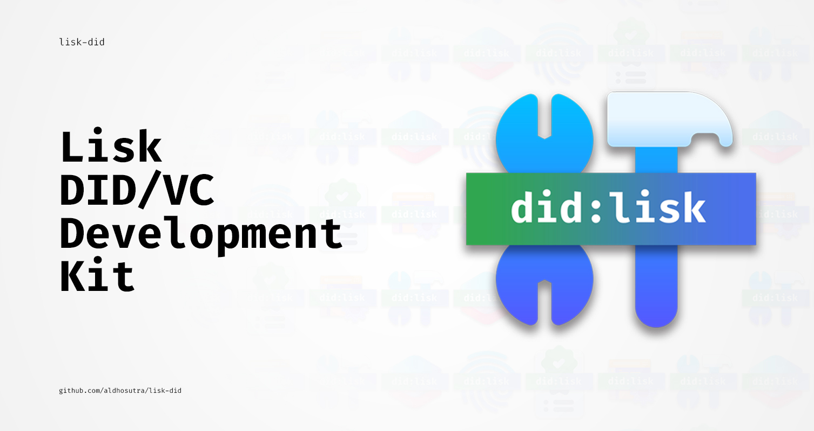

# lisk-did

[](https://npmjs.com/package/lisk-did)
[](https://github.com/aldhosutra/lisk-did/actions)
[](https://app.codecov.io/gh/aldhosutra/lisk-did)
[](http://www.apache.org/licenses/LICENSE-2.0)

Lisk DID/VC Development Kit. `lisk-did` is an all-in-one package that provides you with tools to develop [W3C Decentralized Identifier (DID)](https://www.w3.org/TR/did-core/) and [Verifiable Credentials (VC)](https://www.w3.org/TR/vc-data-model/) solutions for Lisk-based sidechains.

## About Lisk

Lisk is an open-source blockchain application platform written in Javascript, designed to bridge the gap between accessibility and web3 adoption. Learn more about Lisk from their [official website](https://lisk.com), as well as it's public [GitHub Repository](https://github.com/LiskHQ).

## About `did:lisk` Method

`did:lisk` is a DID method specifically designed for Lisk sidechain, which outlines syntax, data model, and operations that adheres to W3C Decentralized Identifiers (DIDs) Specification.

A `did:lisk` DID consist of a method, chainspace, namespace, and unique-id that suitable for specific, tailored, self-sovereign identity use case. An example of a `did:lisk` identifier, is as follows:

```abnf
did:lisk:enevti:address:lsk9gxy8ua2n5sj7eqvtp554hvce8m39sy39sjwzu
```

Please refer to the [did:lisk method spec](https://github.com/aldhosutra/lisk-did/blob/main/packages/lisk-did-module/docs/did-method-spec.md) draft for further explanation. As its still in under active development, community contribution will be much appreciated.

## Getting Started

### Sidechain Setup

Since this tool is tailored for Lisk-based sidechains, you need to start by setting up a blockchain client. You can find guidance on configuring your blockchain environment in the official [Lisk Documentation](https://lisk.com/documentation/beta/build-blockchain/create-blockchain-client.html), as well as in [Lisk Discord #dev-chat channel](https://lisk.chat/)

### Installation

```sh
npm install --save lisk-did
```

## Packages

`lisk-did` bundled with 3 packages, as follows:

| Packages                                                                                                     | Description                                                                                                 |
| ------------------------------------------------------------------------------------------------------------ | ----------------------------------------------------------------------------------------------------------- |
| [@lisk-did/lisk-did-module](https://npmjs.com/package/@lisk-did/lisk-did-module)                             | Lisk module which implements on-chain logic for Lisk decentralized identifiers (DIDs)                       |
| [@lisk-did/lisk-decentralized-identifier](https://npmjs.com/package/@lisk-did/lisk-decentralized-identifier) | A library to work with W3C Decentralized Identifier (DID) for Lisk sidechains with the Lisk DID module      |
| [@lisk-did/lisk-verifiable-credentials](https://npmjs.com/package/@lisk-did/lisk-verifiable-credentials)     | A library for working with W3C verifiable credentials (VC) and verifiable presentations (VP) using Lisk DID |

## Documentation

For further explanations, please refer to [lisk-did documentation](https://lisk-did.js.org) website.

## License

Licensed under the Apache License, Version 2.0 (the "License");
you may not use this file except in compliance with the License.
You may obtain a copy of the License at

    http://www.apache.org/licenses/LICENSE-2.0

Unless required by applicable law or agreed to in writing, software
distributed under the License is distributed on an "AS IS" BASIS,
WITHOUT WARRANTIES OR CONDITIONS OF ANY KIND, either express or implied.
See the License for the specific language governing permissions and
limitations under the License.
